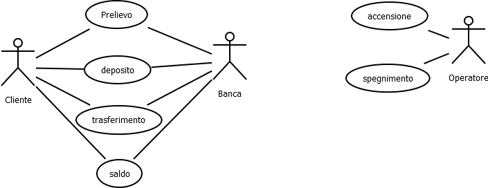

### User Requirements Specification Document

**VERSION : 2.0**

**Authors**  
Massimo Narizzano

**REVISION HISTORY**

| Version    | Date        | Authors      | Notes        |
| ----------- | ----------- | ----------- | ----------- |
| 1.0 | 18/06/2024 | Massimo Narizzano| Inserita prima immagine |
| 2.0 | 18/06/2024 | Massimo Narizzano| Inserita ATM - USE CASE |
| 2.1 | 18/06/2024 | Massimo Narizzano| Inseriti Scenari  |

# Table of Contents

1. [Introduction](#p1)
	1. [Document Scope](#sp1.1)
	2. [Definitios and Acronym](#sp1.2) 
	3. [References](#sp1.3)
2. [System Description](#p2)
	1. [Context and Motivation](#sp2.1)
	2. [Project Objectives](#sp2.2)
3. [Requirement](#p3)
 	1. [Stakeholders](#sp3.1)
 	2. [Functional Requirements](#sp3.2)
 	
  
  

## 1. Introduction

### 1.1 Document Scope

### 1.2 Definitios and Acronym

| Acronym				| Definition | 
| ------------------------------------- | ----------- | 
| XXXX                                  | XXXX |

### 1.3 References 

## 2. System Description

### 2.1 Context and Motivation

Si progetti un software per il controllo di un ATM il quale ha un lettore di
carte magnetiche, una console (tastiera e monitor) per interagire con
il cliente, un cassetto per depositare delle buste, un distributore di
banconote (in multipli di 20) una stampante per stampare le ricevute
per il cliente, uno switch che permette di operare in modalita'
operatore per accendere e spegnere la macchina. L'ATM comunichera'
con la banca tramite una connessione sicura, che pero' non fa' parte
del sistema che vogliamo progettare. L'ATM dovra' servire un cliente
alla volta, e ad ogni utente sara' richiesto di inserire la carta e il suo
PIN, i quali saranno spediti alla banca per la validazione come parte di
ogni transazione. Il cliente non avra' limiti di operazioni, ma la carta
rimarra' nell'ATM fino a quando il cliente indichera' di non voler piu'
eseguire operazioni. A quel punto verra' restituita la carta a meno che
non sia stata ritirata dall'ATM per qualche motivo. 
Se la banca determina che il PIN del cliente e' non valido, l'ATM
richiedera' di inserire nuovamente il PIN. Dopo tre volte la carta viene
prelevata dall'ATM. Se una transazione fallisce (a parte per il PIN non
valido) l'ATM scrivera' sul display il perche' e chiedera' al cliente se
vuole eseguire un'altra transazione. L'ATM fornira' al cliente una
ricevuta stampata per ogni transazione di successo, che mostri la
data, l'ora, la locazione della macchina, il tipo di transazione, il conto o
i conti coinvolti, la somma, e finira' con la scrittura del saldo
considerando anche l'ultima operazione eseguita.
 L'ATM ha un interruttore che permette ad un operatore di accendere o
spegnere la macchina. Dopo che l'operatore ha acceso la macchina
dovra' inserire a mano l'ammontare di soldi presenti nella macchina.
La macchina potra' essere spenta solamente quando non sta servendo
un cliente. La macchina viene spenta per permettere ad un operatore
di rimuovere i depositi, aggiungere carta/contanti etc. 

### 2.2 Project Obectives 
L'ATM dovra' fornire i seguenti servizi al cliente:
Prelievo di contanti da ogni possibile conto associato con la carta a
multipli di 20 euro. La banca deve approvare la transazione.
Deposito di contanti, in una busta, su qualunque account associato
alla carta. Il cliente deve inserire l'ammontare del deposito nella
busta, il quale sara' soggetto ad una ispezione manuale quando la
busta viene rimossa da un operatore. La banca deve approvare la
transazione prima che l'ATM accetti la busta.
Trasferimento di soldi tra due conti associati alla carta.
Verifica del Saldo su qualunque conto associato alla carta.

## 3. Requirements

| Priorità | Significato | 
| --------------- | ----------- | 
| M | **Mandatory:**   |
| D | **Desiderable:** |
| O | **Optional:**    |
| E | **future Enhancement:** |

### 3.1 Stakeholders

1. Cliente : Il cliente è un utente che ha uno o più conti aperti con la banca, e il suo obiettivo è quello di eseguire operazioni sui suoi conti correnti
2. Banca   : E' la depositaria dei conti correnti di ogni Cliente, e vuole costruire il software per il bancomat pechè vuole via via diminuire i cassieri per abbattere i costi
3. Operatore : E' il manutentore del bancomat.

### 3.2 Functional Requirements 
Di seguito possiamo vedere una descrizione delle principali funzionalità

#### 3.2.1 Prelievo 

<b>Nome</b> Prelievo

<b>Precondizioni</b> Essere in possesso di una tessera Bancomat

<b>Priorità</b> Mandatory

<b>Stakeholder Principale</b> Cliente

<b>Scenario Principale</b> 

	1. Cliente inserisce tessera bancomat
 	2. Cliente inserisce pin corretto
  	3. Il cliente seleziona la quantità da prelevare
   	4. ATM eroga le banconote la tessera e la ricevuta
    	5. Il cliente ritira le banconote, la tessera e la ricevuta
     	6. ATM puslisce lo schermo

<b>Scenario Alternativo</b> 

	2A - Il Cliente inserisce il PIN non corretto per la terza volta
 
   		1. ATM Notifica che il PIN è errato 
     		2. L'ATM notifica che non restituisce la tessera
		3. L'ATM va al punto 6 dello scenario principale.
    

<b>Scenario Alternativo</b>

<b>Post-Condizioni</b>

#### 3.2.2 Deposito 

<b>Nome</b>

<b>Precondizioni</b>

<b>Priorità</b>

<b>Stakeholder Principale</b>

<b>Scenario Principale</b>

<b>Scenario Alternativo</b>

<b>Scenario Alternativo</b>

<b>Post-Condizioni</b>

#### 3.2.3 Trasferimento

<b>Nome</b>

<b>Precondizioni</b>

<b>Priorità</b>

<b>Stakeholder Principale</b>

<b>Scenario Principale</b>

<b>Scenario Alternativo</b>

<b>Scenario Alternativo</b>

<b>Post-Condizioni</b>

#### 3.2.4 Saldo
<b>Nome</b>

<b>Precondizioni</b>

<b>Priorità</b>

<b>Stakeholder Principale</b>

<b>Scenario Principale</b>

<b>Scenario Alternativo</b>

<b>Scenario Alternativo</b>

<b>Post-Condizioni</b>

#### 3.2.5 Accensione

<b>Nome</b>

<b>Precondizioni</b>

<b>Priorità</b>

<b>Stakeholder Principale</b>

<b>Scenario Principale</b>

<b>Scenario Alternativo</b>

<b>Scenario Alternativo</b>

<b>Post-Condizioni</b>

#### 3.2.6 Spegnimento

<b>Nome</b>

<b>Precondizioni</b>

<b>Priorità</b>

<b>Stakeholder Principale</b>

<b>Scenario Principale</b>

<b>Scenario Alternativo</b>

<b>Scenario Alternativo</b>

<b>Post-Condizioni</b>

